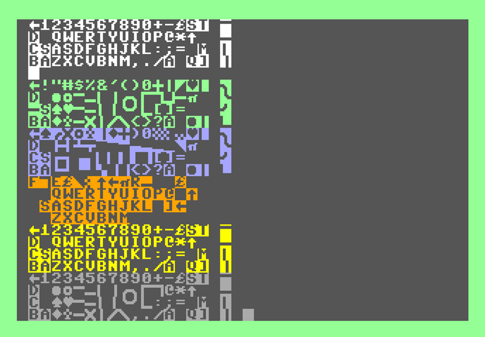

# Commodore Keyboard Mappings - Animated Display

The keyboard maps for unshifted, SHIFT, Commodore, and Control are animated on screen drawing the PETSCII character in scan code order.  Commodore 128 adds Alt and Caps Lock maps, and different results will occur if DIN is pressed on international models.

## Commodore 64 (US)

## Commodore Vic-20 (US)

## Commodore 128 (US)

