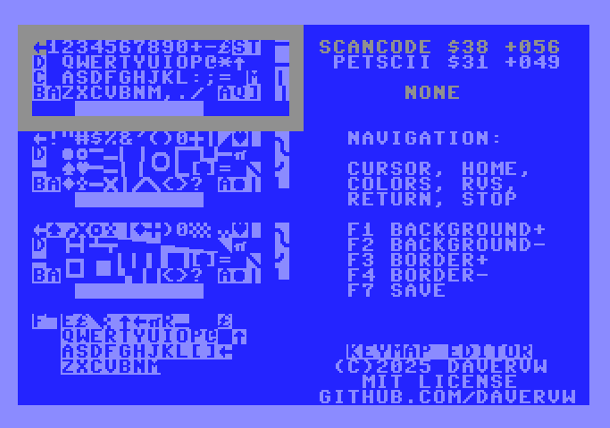
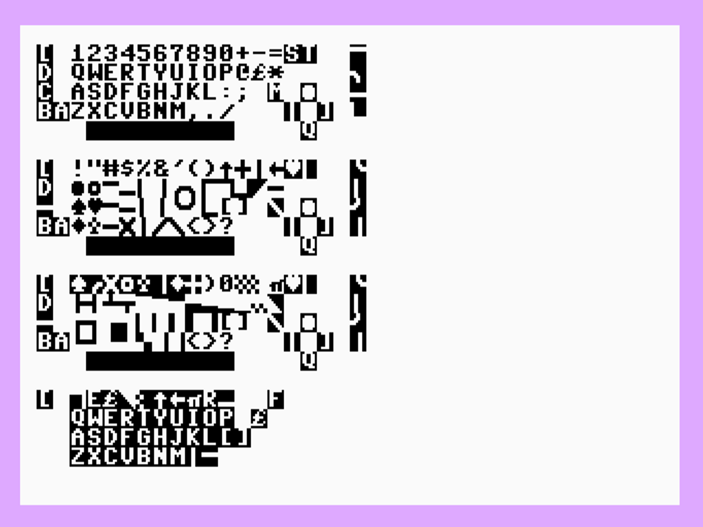
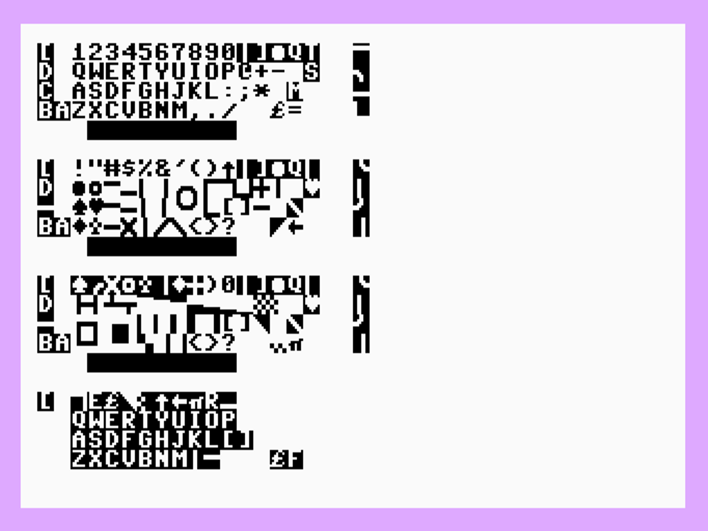

# Commodore Keyboard Mappings - Animated Display & Editor/Driver

The keyboard maps for unshifted, SHIFT, Commodore, and Control are animated on screen drawing the PETSCII character in scan code order.  Commodore 128 adds Alt and Caps Lock maps, and different results will occur if DIN is pressed on international models.  International ROMs are available at [zimmers.net](https://zimmers.net/anonftp/pub/cbm/firmware/).

The BASIC versions are animated because they take a long time to draw, and purposefully draw in scancode (0..63) order, around 30 seconds processing and drawing time.  The machine language port (64) takes less than a second to do the same thing, so while it is doing the same animation, it is so fast you can't see it.

## Commodore 64 

(Editor)


Editor/Driver instructions:

    F1-F4 change colors
    Control 1-8 and Commodore 1-8 change colors (WARNING: loses any changes in current build)
    Cursor keys and Home navigate
    Return opens character chooser window.  Navigate and select with ENTER, or if driver active, can test applied settings.
    Stop exits without saving (no WARNING)
    F7 saves to a driver that can be saved or ````RUN```` to apply changes.
    
WARNING: Save will wipe out any other program loaded at $0801.  Please also ````RUN```` to move next BASIC program to $0A01 otherwise could crash if driver is running and load another program over it.


(US)


(Danish)


(Japan)


(Turkish)


## Commodore Vic-20

(US)


(Swedish/Finnish)


(Japan)


## Commodore 128

(US)


(French)


## Commodore Plus/4

(US)


## Commodore 16

(US)

