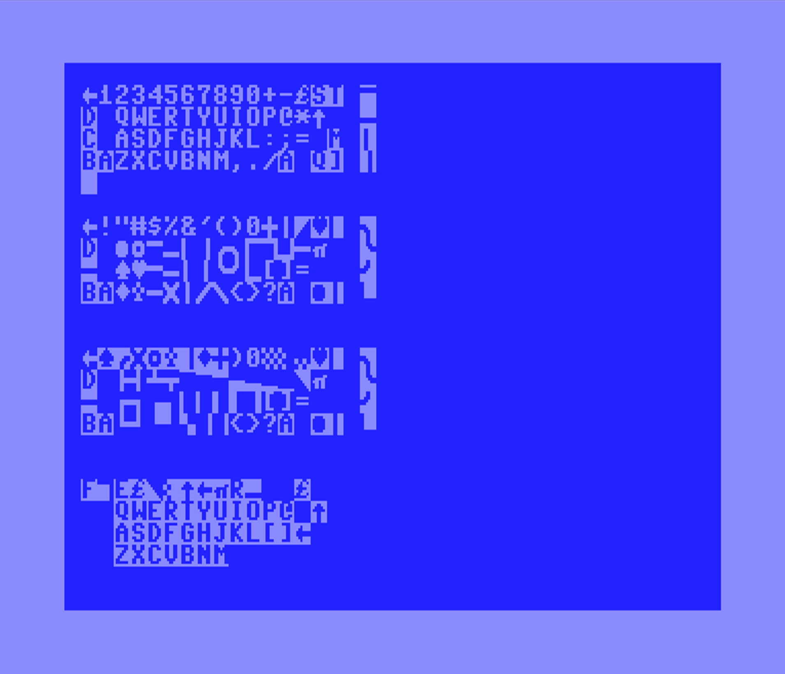
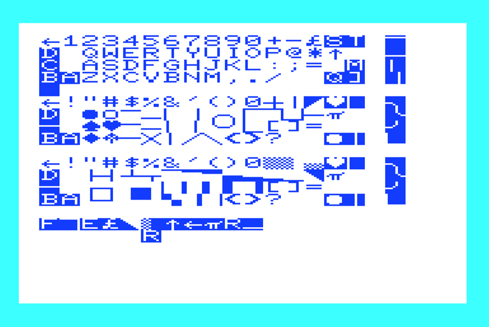

# Commodore Keyboard Mappings - Animated Display

The keyboard maps for unshifted, SHIFT, Commodore, and Control are animated on screen drawing the PETSCII character in scan code order

## Commodore 64 (US)

## Commodore Vic-20 (US)

