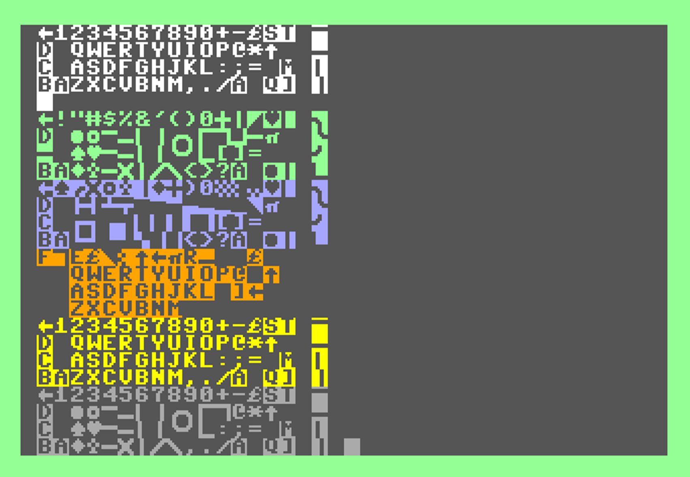

# Commodore Keyboard Mappings - Animated Display

The keyboard maps for unshifted, SHIFT, Commodore, and Control are animated on screen drawing the PETSCII character in scan code order.  Commodore 128 adds Alt and Caps Lock maps, and different results will occur if DIN is pressed on international models.  International ROMs are available at [zimmers.net](https://zimmers.net/anonftp/pub/cbm/firmware/).

The BASIC versions are animated because they take a long time to draw, and purposefully draw in scancode (0..63) order, around 30 seconds processing and drawing time.  The machine language port takes less than a second to do the same thing, so while it is doing the same animation, it is so fast you can't see it.

## Commodore 64 

(US)

(Danish)

(Japan)

(Turkish)

## Commodore Vic-20

(US)

(Swedish/Finnish)

(Japan)

## Commodore 128

(US)

(French)
